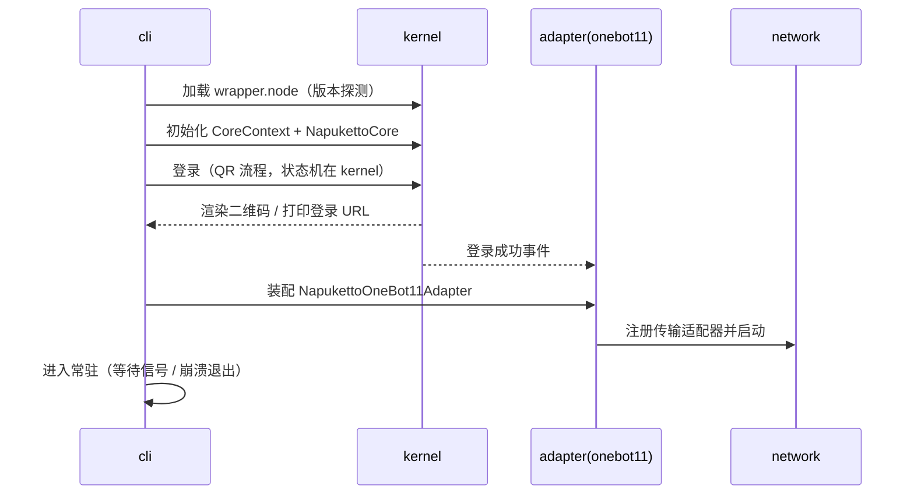

# apps/cli 设计

> 职责：**启动编排、登录渲染、配置命令**。不写业务逻辑，只装配 kernel + 协议层。
> 对应 ADR：005 / 010 / 015 / 016

---

## 1. 边界

- **做**：commander 参数解析、按序启动 kernel → 协议适配器（按 `enabledProtocols`）→ network、终端二维码渲染、`config init/list/apply` 子命令、**多账号子进程编排（ADR-015）**。
- **不做**：业务逻辑（属于 kernel/协议层）、webui（永远不做）。

依赖：`@napuketto/kernel`、`@napuketto/adapter`（+ `@napuketto/network` 按需）、`commander`、`qrcode`、`picocolors`。包 `private: true`，bin 名为 `napuketto`。

## 2. 多账号编排（ADR-015 / ADR-016）

多账号走**多进程**：每账号一个独立子进程（复用单账号逻辑零改动），cli 作为父进程编排。

```bash
napuketto -q 123456              # 单账号（当前）
napuketto -q 123456 -q 789012    # 多账号：cli 拉起两个子进程
napuketto --config accounts.json  # 从文件读账号列表批量启动
```

- 每个子进程独立 `--data-dir`（`<数据根>/<qq号>/`，ADR-016），日志/配置/缓存天然隔离。
- cli 父进程职责：拉起子进程、崩溃自动重启、信号转发（SIGINT/SIGTERM → 优雅退出）。
- **kernel 无全局单例**（ADR-015 推论）：每进程一份实例，由子进程持有。

## 3. 目录结构

```
apps/cli/src/
├── index.ts           # commander 参数解析 + 生命周期编排入口
├── supervisor.ts      # 多账号子进程编排（启动/重启/信号转发，P6）
├── boot.ts            # 单账号启动序列：wrapper-version → core → login → adapter → network
├── login-render.ts    # 二维码渲染（qrcode 终端 / 打印 URL）
└── config-cmds.ts     # napuketto config init/list/apply
```

## 4. 启动序列（单账号）



## 5. 配置命令（webui 的替代，ADR-005）

```bash
napuketto -q 123456               # 指定 QQ 号启动
napuketto config init             # 生成默认配置文件（napcat.json + 各协议配置）
napuketto config list             # 列出配置与生效值
napuketto config apply <file>     # 应用配置变更（触发热更新）
```

配置均为 JSON + zod 校验（schema 在各自包），cli 只做文件读写与流程编排。

## 6. 实现顺序

1. `config-cmds.ts` + `index.ts`（参数解析骨架，P0 可先行）
2. `boot.ts` + `login-render.ts`（P1 与 kernel 登录打通）
3. 常驻进程管理（信号处理、优雅退出、崩溃重启策略，P2 前补）
4. `supervisor.ts` 多账号编排（P6）

## 7. 待验证事项

- 崩溃/退出时的资源清理（network 适配器、日志 flush）顺序。
- 多账号时二维码渲染的终端复用策略（多进程并行打印 vs 排队）。
