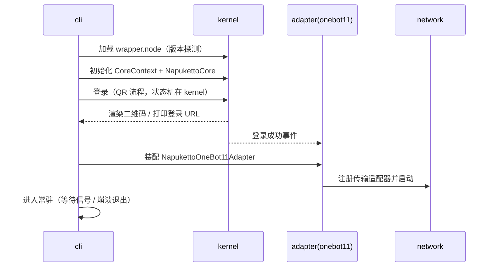

# apps/cli 设计

> 职责：**启动编排、登录渲染、配置命令**。不写业务逻辑，只装配 kernel + 协议层。
> 对应 ADR：005 / 010 / 015 / 016

---

## 1. 边界

- **做**：commander 参数解析、按序启动 kernel → 协议适配器（按 `enabledProtocols`）→ network、终端二维码渲染、`config init/list/apply` 子命令、**多账号子进程编排（ADR-015）**。
- **不做**：业务逻辑（属于 kernel/协议层）、webui（永远不做）。

依赖：`@napuketto/kernel`、`@napuketto/adapter`（+ `@napuketto/network` 按需）、`commander`、`qrcode`、`picocolors`。包 `private: true`，bin 名为 `napuketto`。

## 2. 多账号编排（ADR-015 / ADR-016）

多账号走**多进程**：每账号一个独立子进程（复用单账号逻辑零改动），cli 作为父进程编排。

```bash
napuketto -q 123456              # 单账号（当前）
napuketto -q 123456 -q 789012    # 多账号：cli 拉起两个子进程
napuketto supervisor             # 从主配置 napuketto.json 的 accounts 批量拉起
```

- 每个子进程独立 `--data-dir`（`<数据根>/<qq号>/`，ADR-016），日志/配置/缓存天然隔离。
- cli 父进程职责：拉起子进程、崩溃自动重启、信号转发（SIGINT/SIGTERM → 优雅退出）。
- **kernel 无全局单例**（ADR-015 推论）：每进程一份实例，由子进程持有。

### 2.1 全局配置 napuketto.toml（2026-08-05 用户拍板，单一 TOML 文件；2026-08-07 移到项目根）

**所有配置统一放 `<项目根>/napuketto.toml`**（不再用独立 JSON；2026-08-07 用户拍板：配置文件
放项目根目录，数据（账号目录/日志/缓存/QQ 数据）仍按数据根组织）：

```toml
dataDir = "C:\\Users\\xxx\\.napuketto"   # 数据根，与配置文件位置解耦
autoRestart = true
restartDelayMs = 2000

[[accounts]]
qq = "123456"
enabled = true

[onebot11]                  # 协议段（与 ob11ConfigSchema 对应）
heartbeatInterval = 3000

[onebot11.http]             # 嵌套表
enabled = false
host = "127.0.0.1"
port = 3000
```

- 配置文件路径解析：kernel `resolveConfigPath`（`NAPKETTO_CONFIG` 显式 > 项目根探测 > cwd > 数据根兜底），
  cli 读写、boot.ts 经 launchSelfHost 注入 `NAPKETTO_CONFIG` 供装配链读取。
- 文本格式：smol-toml 解析/序列化（kernel ConfigBase 按 `.toml` 扩展名推断）。
- 校验器：cli 手写 `parse`（适配 kernel ConfigBase 的 ConfigSchema 形状，不引入 zod）；协议段由对应协议包 zod schema 校验（boot.cjs 装配时经 seed 传入）。
- `config init` 生成默认全局配置；账号协议配置不再单独落盘（boot.cjs 从全局 TOML 取段作 seed）。

### 2.2 supervisor 子进程编排（P6）

- 入口：`supervisor` 子命令（读主配置 accounts）或 `-q A -q B`（多值参数，临时列表）。
- 每账号 spawn `node <当前入口> -q <uin> --data-dir <dataRoot>`（子进程走 runSingleAccount 单账号逻辑零改动）。
- 重启：子进程异常退出（code≠0 / 被信号杀）且 `autoRestart` → 延迟 `restartDelayMs` 重启；`enabled:false` 跳过。
- 信号转发：父进程 SIGINT/SIGTERM → 逐个 kill 子进程 → 全部退出后父进程退出。

## 3. 目录结构

```
apps/cli/src/
├── index.ts           # commander 参数解析 + 生命周期编排入口
├── supervisor.ts      # 多账号子进程编排（启动/重启/信号转发，P6）
├── boot.ts            # 单账号启动序列：定位 QQ → 自建宿主拉起 → 常驻
├── logger.ts          # cli 进程级 pino logger（复用 kernel createLogger，name=cli）
└── config-cmds.ts     # napuketto config init/list/apply
```

## 3.1 日志规范（2026-08-07 统一改造）

**全部 cli 输出走 pino 结构化日志**（ADR-007，复用 kernel `createLogger`，格式与 kernel
子进程完全一致：`[HH:MM:ss.l] LEVEL (name/pid): 消息` + 元数据，可按行解析做自动化运维）：
- 前缀短格式（`translateTime: "HH:MM:ss.l"`，2026-08-07 用户定稿）：完整日期+时区近 60 字符，
  每条日志重复占满横向视线；文件日志（JSON）保留完整时间戳。

- `logger.ts` 提供模块级单例（每进程一份，ADR-015 推论）：console pretty、不写文件
  （文件日志由 kernel 装配负责：`<数据根>/logs/napuketto.log`）、`base: { name: "cli" }`
  标注来源（pino 保留字段 name，pino-pretty 渲染为 `(cli/pid)` 元数据头，不占属性行）、
  级别经 `NAPKETTO_LOG_LEVEL` 环境变量覆盖（缺省 info）。
- **console 渲染（2026-08-07 定稿）**：pino-pretty 原生多行展开（`singleLine: false`），
  带属性日志（安装信息/数据目录）逐字段上色高亮；高频业务日志由 loader 在调用点直接传
  纯字符串 → 天然单行防刷屏，**消息内部颜色分层**（前缀灰/群 ID 青/用户 ID 绿/内容默认色，
  ANSI Escape Codes）由 loader 实现（见 loader design §3.1）。
  ⚠️ 不手写 `messageFormat` 拼串（丢颜色 + 缩进碰撞，已回退）。
- 启动信息带元数据：`logger.info({ qqVersion, qqPath }, ...)` / `{ dataDir }`；
  错误统一 `logger.error({ err }, ...)`（err 保留给 prettifyError 显示堆栈）。
- **例外（功能输出）**：`config init/list/apply` 的 TOML 正文是机器可读的功能输出，
  **保持原样 `process.stdout.write`，不做日志包装**；仅状态提示（数据根/配置文件路径）走日志。
- BANNER 字符画（品牌标识）保留 `process.stdout.write`，不经 logger。
- 原生噪音过滤（`boot.ts` NATIVE_NOISE）：wrapper.node 直写 fd 的 C++ 日志
  （`<MMKV` / `loaded [mmkv.*]` / `get symbol failed` 等）在转发子进程输出时过滤，不留终端。

## 4. 启动序列（单账号）



## 5. 配置命令（webui 的替代，ADR-005）

```bash
napuketto -q 123456               # 指定 QQ 号启动
napuketto -d <dir> config init    # 生成默认全局配置（napuketto.toml + 目录骨架）
napuketto -d <dir> config list    # 列出全局配置与各账号配置
napuketto -d <dir> config apply <file>  # 应用外部配置（TOML/JSON，校验后写回全局配置）
napuketto -d <dir> supervisor     # 多账号编排（读全局配置 accounts）
```

> ⚠️ commander 限制：主命令已定义 `-d/--data-dir` 时，子命令定义同名 option 会解析失效（实测）——因此 `-d` 只定义在主命令，config/supervisor 子命令经 `program.opts()` 读取。

配置均为 JSON + zod 校验（schema 在各自包，主配置 cli 手写校验器包装），cli 只做文件读写与流程编排。

## 6. 实现顺序

1. ✅ `config-cmds.ts` + `index.ts`（参数解析骨架，P0 可先行）
2. ✅ `boot.ts` + `login-render.ts`（P1 与 kernel 登录打通）
3. ✅ 常驻进程管理（信号处理、优雅退出、崩溃重启策略，P2 前补）
4. ✅ `supervisor.ts` 多账号编排（**P6，2026-08-05 实现**：config init/list/apply + supervisor 子命令 + 多 -q）

## 7. 待验证事项

- 崩溃/退出时的资源清理（network 适配器、日志 flush）顺序。
- 多账号时二维码渲染的终端复用策略（多进程并行打印 vs 排队）。
