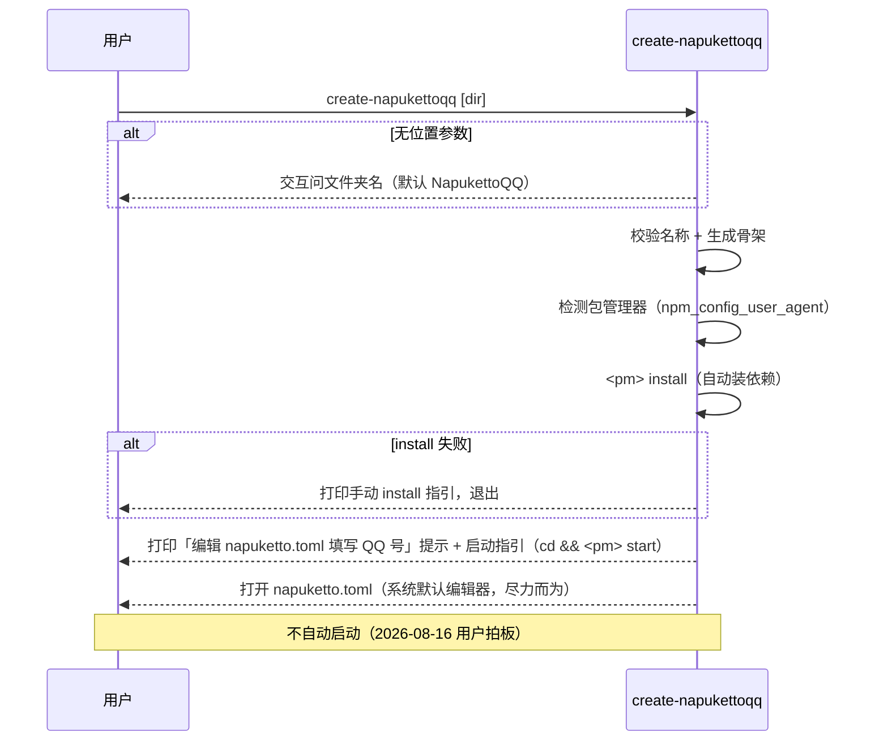

# apps/create-napukettoqq 设计

> 职责：**npm 脚手架包**（`create-napukettoqq`），让用户 `yarn create napukettoqq` /
> `pnpm create napukettoqq` / `npm create napukettoqq` 一键生成可运行的
> NapukettoQQ 机器人项目（**不自动启动**——生成后打开配置供填写 QQ 号 +
> 控制台打印启动指引，2026-08-16 用户拍板）。
>
> 2026-08-07 用户拍板：交互只问部署文件夹名（默认 NapukettoQQ）+ 生成后自动
> install；包管理器按调用方自动检测（不默认 pnpm）；包放在 `apps/create-napukettoqq`；
> 顺带做发布准备。

---

## 1. 背景与机制

- `yarn create <name>` / `pnpm create <name>` / `npm create <name>` 的行为：包管理器
  自动拉取 npm registry 上名为 `create-<name>` 的包并执行其 bin。因此脚手架包名
  必须为 **`create-napukettoqq`**，bin 同名。
- 脚手架生成的是**独立用户项目**（非 monorepo 包），形态为 **npm 包依赖**：
  项目 `package.json` 声明 `@napuketto/cli` 依赖，用户 install 后 `start` 经 cli →
  loader 自建宿主（标准 node + stub QQNT.dll）启动。
- QQ 资源（`wrapper.node`）来自用户本机 QQ NT 安装目录，cli `--qq-path` 可指定
  （缺省自动探测）；脚手架不在生成时下载 QQ（腾讯版权，只能引导）。

## 2. 边界

- **做**：解析文件夹名（位置参数或交互问答）→ 校验 → 生成项目骨架
  （**仅** `package.json` + `napuketto.toml`）→ **自动 install**（用检测到的
  包管理器）→ **打开 napuketto.toml 供填写 QQ 号 + 打印启动指引**（不自动启动，
  2026-08-16 用户拍板：占位账号启动无意义，且自动前台运行占用终端）。
- **不做**：下载/复制 QQ 资源、业务逻辑、协议装配（全部交给 cli 项目）；
  **不自动启动**（2026-08-16 用户拍板取消「是否现在启动」，改为打开配置文件 +
  打印指引；占位账号启动无意义，且自动前台运行占用终端）；
  **不生成 readme.md / .gitignore**——用户项目是「运行壳」，生成后不写代码，
  编辑 `napuketto.toml` 后 `start` 就跑：readme 没人看、.gitignore 在用户不
  `git init` 时是死文件（2026-08-07 用户质疑后移除）。
- **依赖**：零内部依赖；第三方仅 **`@clack/prompts`**（v1.7.0，脚手架交互事实
  标准，create-vue / create-turbo 同款）——2026-08-07 用户拍板替换
  prompts+kleur：一站式提供 `intro`/`outro` 边框、`text`/`confirm` 交互、
  `spinner` 进度、`log` 分级输出、`isCancel`/`cancel` 取消处理，自带 ANSI 着色
  （无需单独 kleur），解压仅 116KB。其余用 `node:fs/promises`、`node:path`、
  `node:os`、`node:process`、`node:child_process`。
- **输出**：脚手架是独立发布的面向用户工具，输出为功能提示（等效 cli 的「功能输出」
  例外），用 `console.log` / `process.stdout.write`，不走 pino。

## 3. 包管理器自动检测（2026-08-07，不默认 pnpm）

**用户可以用自己的包管理器**——脚手架按调用方检测，用同款 install/start：

- 检测源：环境变量 `npm_config_user_agent`（npm/yarn/pnpm 执行 create 时都会注入）：
  - `pnpm/11.6.0 npm/? node/v24...` → **pnpm**
  - `yarn/4.x npm/? node/v24...` → **yarn**
  - `npm/11.x node/v24...` → **npm**
- 兜底（无 user_agent，如直接 `node dist/index.mjs`）：**pnpm**（项目生态）。
- Windows 下 bin 需带 `.cmd` 后缀（`pnpm.cmd`/`yarn.cmd`/`npm.cmd`，CreateProcess
  不认无扩展名 shim）。
- 生成的项目本身与包管理器无关（仅依赖 + scripts），只是脚手架的 install/start
  命令按检测结果动态生成。**脚手架代码写死 pnpm 是缺陷，已修。**

## 4. CLI 参数与交互（2026-08-07 美化 v3，交互层用 @clack/prompts）

```bash
create-napukettoqq                # intro + 交互问：部署文件夹名（默认 NapukettoQQ）
create-napukettoqq my-bot         # 位置参数指定文件夹名，跳过命名交互
create-napukettoqq my-bot -f      # 目标目录非空时强制清空覆盖
create-napukettoqq -y             # 全默认：命名用默认值（无启动询问）
create-napukettoqq -h             # 打印 usage 退出
```

**视觉**（`@clack/prompts`，现代脚手架标准）：

- `intro`：顶边框 + **按包管理器品牌色**的标题 `create-napukettoqq  v0.x.x`
- `text`：文件夹名输入（**placeholder 淡灰默认名**：直接回车 = 用默认名，键入任意
  字符 = 从空自定义；`validate` 复用 `validateProjectName`，**空输入不报错**走默认）
- `confirm`：确认清空（`initialValue` 默认值）
- `spinner`：生成骨架时的进度动画
- `log.info/warn/error/success/step`：分级输出（安装进度、指引；**命令一律带
  品牌色**）
- `outro`：底边框收尾
- `cancel`：Ctrl+C / 取消 → 打印取消消息退出 0；非 TTY（CI）→ 用默认值兜底

**品牌色定向（2026-08-09 美化 v4，对齐 koishi create 观感）**：
按 `detectPackageManager()` 结果对关键输出着色（`picocolors`，clack 同款着色库，
显式声明依赖），16 色近似 + bold（兼容所有终端，不依赖 truecolor）：

| 包管理器 | 颜色 | 应用点 |
|---|---|---|
| pnpm | 黄（PNPM 橙近似） | intro 标题、`<pm> install`、结束指引命令 |
| yarn | 蓝（Yarn 蓝近似） | 同上 |
| npm | 红（npm 红近似） | 同上 |

品牌色只做「标题 + 命令」两层，不做三套 UI（过度设计）；包管理器不再单独
`log.info` 报「自动检测」——intro 品牌色已暗示。

**流程**：

1. **解析参数**（手写，不引 yargs-parser——flag 仅三个）：位置参数 `[name]`、
   `-f/--forced`、`-y/--yes`、`-h/--help`。
2. **intro** → **问文件夹名**（位置参数或 `-y` 则跳过），校验：非空、非 `.`/`..`、
   不含 Windows 非法字符 `\/:*?"<>|`。
3. **目标目录准备**：
   - 不存在 / 为空 → 直接生成；
   - **已存在且非空** → `log.warn` 警告 + `confirm`「移除现有文件并继续？」
     （`-f` 跳过确认直接清空；`-y` **不**隐式清空——清空需显式 `-f`，
     与 koishi 有意差异：无人值守下不默认删用户数据）；取消 → 退出 0。
4. **生成骨架**（`spinner`）：`package.json`（name=派生名，小写、空格→`-`；
   scripts.start=`napuketto`；dependencies: `@napuketto/cli`）+ `napuketto.toml`
   （cli configTemplate 同款，dataDir=~/.napuketto 插值）。仅此两个文件。
   **完成后画文件树**（`<dir>/ ├── package.json └── napuketto.toml`，品牌色勾 +
   dim 树枝），提升完成感。
5. **自动 install**：`<检测到的pm> install`（stdio 继承，用户可见进度）。
   **失败** → `log.error` 打印手动安装指引（`cd <dir> && <pm> install`），退出码 1。
6. **不自动启动（2026-08-16 用户拍板）**：`log.message` 提示「编辑 napuketto.toml
   填写 QQ 号（[[accounts]] 段 qq 字段）」，打印启动指引
   （`cd <相对路径> && <pm> start`），**打开 napuketto.toml**（系统默认编辑器，
   尽力而为，失败不阻塞），并提示 Ctrl+C 停止、协议端口配置见文件内注释。
7. **outro** 收尾。

## 5. 生成的项目骨架（模板为独立文件，随包发布）

```
<目标目录>/
├── package.json      # name=派生名；dependencies: { "@napuketto/cli": "<版本>" }
│                     # scripts.start = "napuketto"（经 node_modules/.bin）
└── napuketto.toml    # 与 cli configTemplate 同款内容（dataDir = ~/.napuketto 插值）
```

**仅两个文件**（2026-08-07 用户质疑后精简）：用户项目是「运行壳」，生成后不写
代码、不开仓库，readme/.gitignore 是死文件，已移除。启动指引由脚手架交互直接打印。

**模板独立化（2026-08-07）**：模板文件放 `apps/create-napukettoqq/templates/`（随
npm 包发布，`files` 含 `templates/`），运行时 `scaffold.ts` 读取 + `{{key}}`
占位符渲染（`renderTemplate`，未提供的占位符抛错防漏插值）。**不再硬编码在源码
里**。渲染变量：`{{packageName}}`（派生包名）、`{{cliVersion}}`（cli 版本范围，
见 §1 的 cliVersionRange；napuketto.toml 不再插值 dataDir——缺省 = 项目根/.napuketto，
跨平台）。

- 模板文件后缀统一 `.tmpl`（`templates/package.json.tmpl`、
  `templates/napuketto.toml.tmpl`）：避免 VS Code 的 TOML/JSON 语言服务把
  `{{dataDir}}` 等占位符当非法语法报 `expected identifier`；模板名 → 输出名
  的映射在 `scaffold.ts` 的 `files` 数组（去掉 `.tmpl` 后缀写盘）。
- 根目录 `napuketto.toml.example` 已删除（2026-08-07 用户质疑）：有
  `napuketto config init` 与脚手架生成配置，示例文件与 cli 内置模板/脚手架
  模板三处重复维护，无人阅读，冗余。

- 模板与 `apps/cli/src/config-cmds.ts` 的 `configTemplate()` 保持一致（双维护，
  模板极少变更）；脚手架生成后用户首次启动，cli 检测到配置已存在不会覆盖。

## 6. 启动序列（脚手架运行时）



## 7. 发布准备（2026-08-07 一并做）

| 项 | 位置 | 说明 |
|---|---|---|
| cli 去 private | `apps/cli/package.json` | `private: true` 删除，允许 npm 发布 |
| loader 去 private | `packages/loader/package.json` | 同上 |
| loader files 加 stub | `packages/loader/package.json` | `files` 加 `native/build/stub-test-env`（stub QQNT.dll 二进制，仅分发编译产物） |
| 根 publish 脚本 | 根 `package.json` | `pnpm -r publish --access public`（pnpm 拓扑序自动先发布依赖） |
| 根 private | 根 `package.json` | `private: true`（根是 monorepo 聚合器，不发布；否则 pnpm -r publish 会尝试发布根包 → 大写包名 404） |

> **2026-08-07 用户拍板：stub 不做混淆**。理由：① stub 仅含公开符号表（wrapper.node
> 导入表元数据，`llvm-objdump` 可 dump）+ 空函数（IsEnvironmentStopping / PerfTrace），
> 无机密可护；真正机密（RVA 表/逆向结论）在私有子仓库 `native/`，不随 npm 发布；
> ② 加壳/UPX 改变 PE 结构，徒增杀软误报与腾讯安全组件检测风险。混淆收益为负。
>
> **发布踩坑（2026-08-07）**：scoped 包（`@napuketto/*`）要求 scope 组织已注册，
> 否则 `Scope not found` 404——发布前先到 https://www.npmjs.com/org/create 创建
> `napuketto` 组织；`create-napukettoqq`（非 scoped）无此要求，已先发布成功。
> 另外：未认证用户 PUT 不存在的包统一回 404（CouchDB 语义），`pnpm login` 失败时
> 也会看到 404 而非 401。

> **workspace:* 改写（2026-08-16 修复）**：发布环节走 `scripts/release/release-npm.ts`
> （npm publish 逐个发布），该脚本发布前把每个包 package.json 的 `workspace:*`
> 依赖改写为 caret 真实版本、发布后恢复原样（`rewriteWorkspaceProtocol`，幂等：
> `pnpm changeset version` 正常跑时已改写则空转）。此前曾绕过 changeset 直发，
> published 包泄漏 `workspace:*`，yarn create / npm install 被迫交互选版本或直接失败。

## 8. 实现顺序

1. ✅ 本设计文档
2. ✅ `package.json`（bin → `dist/index.mjs`，零依赖）
3. ✅ `src/scaffold.ts`（模板 + 目录创建 + 文件写入 + 校验 + 包管理器检测）
4. ✅ `src/index.ts`（参数解析 + readline 交互 + install + 启动询问）
5. ✅ 发布准备（cli/loader 去 private、loader files、根 publish 脚本 + 根 private）
6. ✅ `pnpm check` + `pnpm -r build` + 冒烟
7. ✅ 提交合并 master
8. ✅（2026-08-07 美化 v2）参考 koishi create：banner / kleur 彩色 / prompts 交互 /
   `-f -y -h` 参数 / 非空目录询问清空 / 启动指引
9. ✅（2026-08-07 美化 v3）交互层换 `@clack/prompts`（intro/outro/spinner/log，
   一站式现代化交互，替代 prompts+kleur）
10. ✅（2026-08-09 美化 v4）对齐 koishi create 观感：text placeholder 淡灰默认名
    （去 initialValue，空输入走默认）、按包管理器品牌色定向（picocolors：
    pnpm 黄 / yarn 蓝 / npm 红）、生成后文件树、去掉「包管理器自动检测」冗余 log