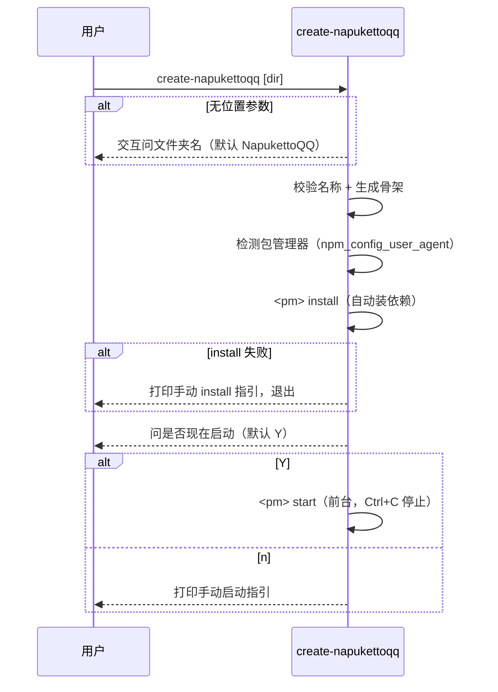

# apps/create-napukettoqq 设计

> 职责：**npm 脚手架包**（`create-napukettoqq`），让用户 `yarn create napukettoqq` /
> `pnpm create napukettoqq` / `npm create napukettoqq` 一键生成**并启动**可运行的
> NapukettoQQ 机器人项目。
>
> 2026-08-07 用户拍板：交互只问部署文件夹名（默认 NapukettoQQ）+ 生成后自动
> install + 询问是否现在启动（默认 Y）；包管理器按调用方自动检测（不默认 pnpm）；
> 包放在 `apps/create-napukettoqq`；顺带做发布准备。

---

## 1. 背景与机制

- `yarn create <name>` / `pnpm create <name>` / `npm create <name>` 的行为：包管理器
  自动拉取 npm registry 上名为 `create-<name>` 的包并执行其 bin。因此脚手架包名
  必须为 **`create-napukettoqq`**，bin 同名。
- 脚手架生成的是**独立用户项目**（非 monorepo 包），形态为 **npm 包依赖**：
  项目 `package.json` 声明 `@napuketto/cli` 依赖，用户 install 后 `start` 经 cli →
  loader 自建宿主（标准 node + stub QQNT.dll）启动。
- QQ 资源（`wrapper.node`）来自用户本机 QQ NT 安装目录，cli `--qq-path` 可指定
  （缺省自动探测）；脚手架不在生成时下载 QQ（腾讯版权，只能引导）。

## 2. 边界

- **做**：解析文件夹名（位置参数或交互问答）→ 校验 → 生成项目骨架
  （`package.json` / `napuketto.toml` / `readme.md` / `.gitignore`）→ **自动
  install**（用检测到的包管理器）→ **询问是否现在启动（默认 Y）** → 前台启动。
- **不做**：下载/复制 QQ 资源、业务逻辑、协议装配（全部交给 cli 项目）。
- **依赖**：零内部依赖、零第三方依赖（只用 `node:fs/promises`、`node:path`、
  `node:os`、`node:process`、`node:readline/promises`、`node:child_process`）——
  一次性工具，保持自包含。
- **输出**：脚手架是独立发布的面向用户工具，输出为功能提示（等效 cli 的「功能输出」
  例外），用 `console.log` / `process.stdout.write`，不走 pino。

## 3. 包管理器自动检测（2026-08-07，不默认 pnpm）

**用户可以用自己的包管理器**——脚手架按调用方检测，用同款 install/start：

- 检测源：环境变量 `npm_config_user_agent`（npm/yarn/pnpm 执行 create 时都会注入）：
  - `pnpm/11.6.0 npm/? node/v24...` → **pnpm**
  - `yarn/4.x npm/? node/v24...` → **yarn**
  - `npm/11.x node/v24...` → **npm**
- 兜底（无 user_agent，如直接 `node dist/index.mjs`）：**pnpm**（项目生态）。
- Windows 下 bin 需带 `.cmd` 后缀（`pnpm.cmd`/`yarn.cmd`/`npm.cmd`，CreateProcess
  不认无扩展名 shim）。
- 生成的项目本身与包管理器无关（仅依赖 + scripts），只是脚手架的 install/start
  命令按检测结果动态生成。**脚手架代码写死 pnpm 是缺陷，已修。**

## 4. 交互与流程

```bash
create-napukettoqq                # 交互问：部署文件夹名（默认 NapukettoQQ）
create-napukettoqq my-bot         # 位置参数指定文件夹名，跳过交互
```

1. **问文件夹名**（有位置参数则跳过），校验：非空、非 `.`/`..`、不含 Windows
   非法字符 `\/:*?"<>|`。目标目录已存在且非空 → 报错退出。
2. **生成骨架**：`package.json`（name=派生名，小写、空格→`-`；scripts.start=
   `napuketto`；dependencies: `@napuketto/cli`）+ `napuketto.toml`（cli configTemplate
   同款，dataDir=~/.napuketto 插值）+ `readme.md`（包管理器无关，pnpm 为例）+ `.gitignore`。
3. **自动 install**：`<检测到的pm> install`（stdio 继承，用户可见进度）。
   **失败** → 打印手动安装指引（`cd <dir> && <pm> install`），退出码 1。
4. **问「是否现在启动？（默认 Y/n）」**：
   - **Y** → `<pm> start`（stdio 继承，**前台运行**，Ctrl+C 停止机器人后脚手架退出）
   - **n** → 打印手动启动指引（`cd <dir> && <pm> start -q <QQ号>`）

## 5. 生成的项目骨架（模板内嵌于 scaffold.ts）

```
<目标目录>/
├── package.json      # name=派生名；dependencies: { "@napuketto/cli": "^0.0.1" }
│                     # scripts.start = "napuketto"（经 node_modules/.bin）
├── napuketto.toml    # 与 cli configTemplate 同款内容（dataDir = ~/.napuketto 插值）
├── readme.md         # 快速开始 / 前置要求 / 常用命令
└── .gitignore        # node_modules/ dist/ *.log 等
```

- 模板与 `apps/cli/src/config-cmds.ts` 的 `configTemplate()` 保持一致（双维护，
  模板极少变更）；脚手架生成后用户首次启动，cli 检测到配置已存在不会覆盖。
- 版本号集中为常量 `CLI_VERSION`，发布新版时统一改。

## 6. 启动序列（脚手架运行时）



## 7. 发布准备（2026-08-07 一并做）

| 项 | 位置 | 说明 |
|---|---|---|
| cli 去 private | `apps/cli/package.json` | `private: true` 删除，允许 npm 发布 |
| loader 去 private | `packages/loader/package.json` | 同上 |
| loader files 加 stub | `packages/loader/package.json` | `files` 加 `native/build/stub-test-env`（stub QQNT.dll 二进制，仅分发编译产物） |
| 根 publish 脚本 | 根 `package.json` | `pnpm -r publish --access public`（pnpm 拓扑序自动先发布依赖） |
| 根 private | 根 `package.json` | `private: true`（根是 monorepo 聚合器，不发布；否则 pnpm -r publish 会尝试发布根包 → 大写包名 404） |

> **2026-08-07 用户拍板：stub 不做混淆**。理由：① stub 仅含公开符号表（wrapper.node
> 导入表元数据，`llvm-objdump` 可 dump）+ 空函数（IsEnvironmentStopping / PerfTrace），
> 无机密可护；真正机密（RVA 表/逆向结论）在私有子仓库 `native/`，不随 npm 发布；
> ② 加壳/UPX 改变 PE 结构，徒增杀软误报与腾讯安全组件检测风险。混淆收益为负。
>
> **发布踩坑（2026-08-07）**：scoped 包（`@napuketto/*`）要求 scope 组织已注册，
> 否则 `Scope not found` 404——发布前先到 https://www.npmjs.com/org/create 创建
> `napuketto` 组织；`create-napukettoqq`（非 scoped）无此要求，已先发布成功。
> 另外：未认证用户 PUT 不存在的包统一回 404（CouchDB 语义），`pnpm login` 失败时
> 也会看到 404 而非 401。

> pnpm 发布时 `workspace:*` 依赖自动替换为实际版本号，无需手动改依赖声明。

## 8. 实现顺序

1. ✅ 本设计文档
2. ✅ `package.json`（bin → `dist/index.mjs`，零依赖）
3. ✅ `src/scaffold.ts`（模板 + 目录创建 + 文件写入 + 校验 + 包管理器检测）
4. ✅ `src/index.ts`（参数解析 + readline 交互 + install + 启动询问）
5. ✅ 发布准备（cli/loader 去 private、loader files、根 publish 脚本 + 根 private）
6. ✅ `pnpm check` + `pnpm -r build` + 冒烟
7. ✅ 提交合并 master
